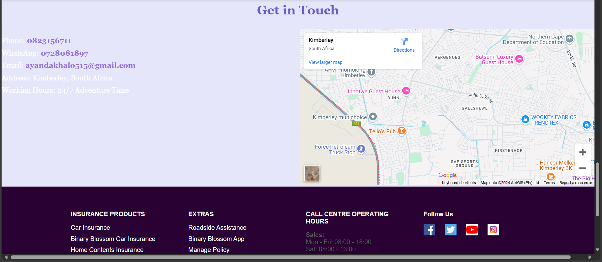
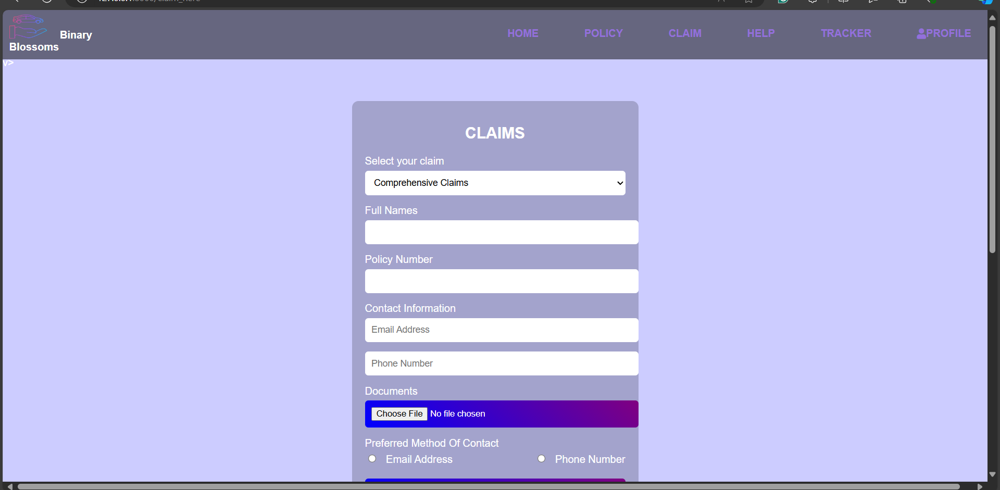

# Car-insurance-system
Car insurance system

# Binary Blossoms Car Insurance System 

Binary Blossoms is a user-friendly and modern car insurance system designed to simplify the process of buying, managing, and claiming insurance policies. Tailored for users in the Northern Cape, South Africa, the platform ensures seamless digital experience, secure payments, and efficient customer support.

---

##  Features

-  **Homepage** with navigation bar and mission statement
-  **Policy Generation** with custom coverage plans
-  **Secure Payments** for all policy types
- **User Authentication** (Sign up, Login, Forgot Password)
-  **Admin Dashboard** to manage claims and users
-  **Claims Submission** with document upload
- **Car Tracking** for real-time vehicle monitoring

---

## 🖼Screenshots

### 1. Home Page

### 2. Sign Up

### 3. Log In

### 4. Forgot Password

### 5. Policy Options

### 6. Policy creation

### 7. Payment

### 8. Claim types

### 9. Claim Submission Form

## Database Overview

Includes tables like:

| Table       | Description                         |
|-------------|-------------------------------------|
| `User`      | Stores user profile information     |
| `Login`     | Handles user authentication         |
| `Policy`    | Stores car and insurance info       |
| `Payment`   | Tracks payment transactions         |
| `Claims`    | Stores user-submitted insurance claims |
| `Documents` | Uploaded supporting documents       |

##  Tech Stack

- **Framework**: Django (Python)
- **IDE**: Visual Studio Code
- **Database**: SQLite (default for Django)
- **Frontend**: HTML, CSS 
- **Version Control**: Git + GitHub

1. **Open Visual Studio Code**

2. Go to `File > Open Folder` and select the project folder ( `Binary-Blossoms`).

3. Open a new terminal inside VS Code (`Ctrl + ~` or use the Terminal menu).

4. In the terminal, cd the pathe
5. Then run using python manage.py runserver

